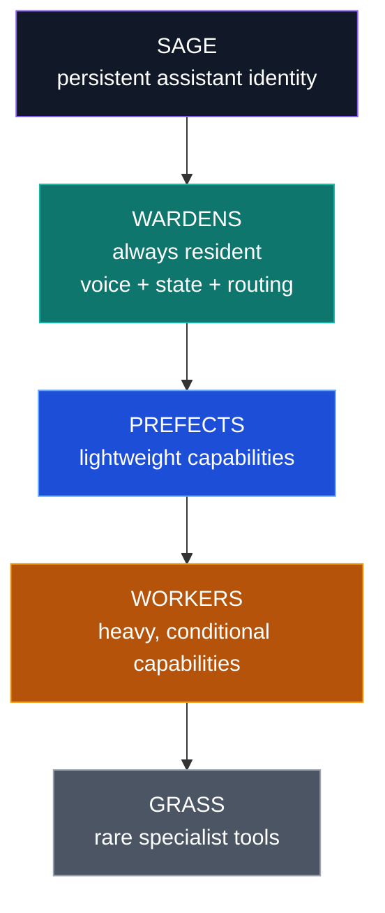
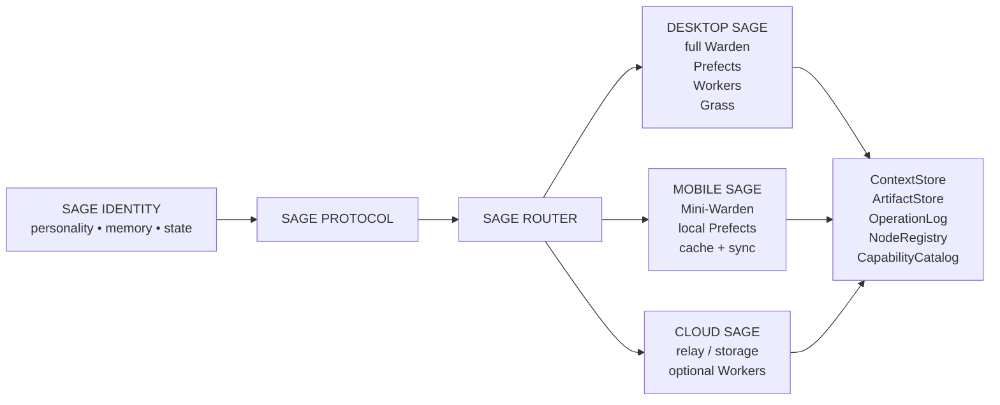
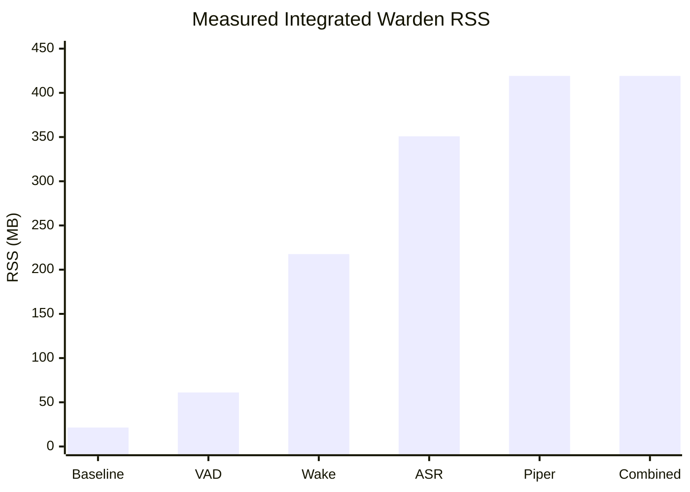
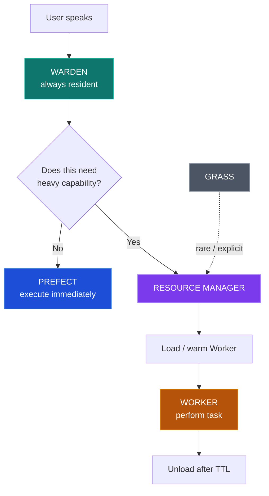
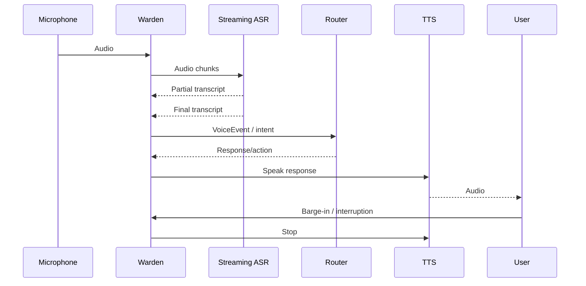
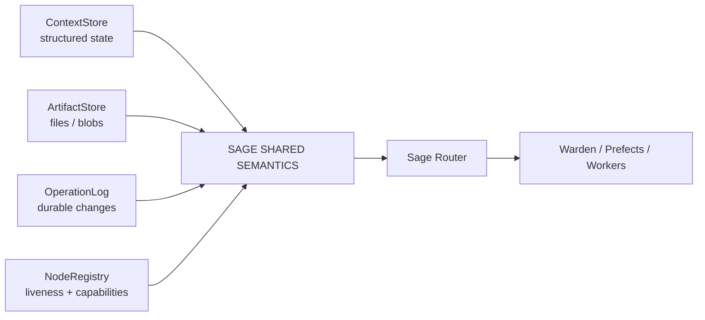

# Project Sage — Lightweight Voice-First Assistant Experiment

> **An archived engineering experiment in building a contained, voice-first personal assistant under an 8 GB RAM constraint.**

[](https://github.com/omegabolt256/project-sage-experiment)
[](https://www.microsoft.com/windows)
[](#measured-results)
[](#measured-results)

Project Sage was an experimental attempt to build a **lightweight, open-source, voice-first personal assistant** that could remain useful on modest hardware rather than assuming a large GPU workstation.

The project was not completed as a production assistant. It is preserved because the architecture experiments, memory measurements, model-selection failures, and engineering lessons are useful on their own.

---

## The idea

The central design principle was:

> **Keep the minimum conversational substrate resident; acquire expensive capabilities only when needed.**

That led to a four-layer capability pyramid:



### Capability layers

| Layer | Role | Examples |
|---|---|---|
| **Warden** | Persistent conversational presence | audio I/O, VAD, wake, streaming ASR, TTS, router, resource manager |
| **Prefect** | Lightweight capability without heavy model activation | calculator, memory, filesystem, tasks |
| **Worker** | Heavy capability activated on demand | reasoning, document analysis, vision, research synthesis |
| **Grass** | Rare/specialist capability | x64dbg, FrameShift, Cupscale, experimental tools |

---

## A second axis: where Sage runs

One of the project's strongest architectural conclusions was that **capability tier** and **deployment location** should be separate dimensions.



The important separation is:

```text
CAPABILITY AXIS
Warden / Prefect / Worker / Grass

DEPLOYMENT AXIS
Desktop / Mobile / Cloud
```

A Worker is a capability. Desktop is a place where that capability may execute.

---

# Measured results

These numbers are the strongest reason to preserve the project.

All measurements below were taken during the actual Windows experiments on the target machine and should be treated as **experiment-specific measurements, not universal benchmarks**.

## 1. Integrated Warden memory benchmark

The resident voice stack was loaded into **one Python process** and kept alive.

| Component | Integrated RSS delta |
|---|---:|
| Python baseline | **21.5 MB** |
| Silero VAD | **+39.6 MB** |
| Wake-word runtime proxy | **+156.5 MB** |
| Streaming ASR | **+133.2 MB** |
| Piper TTS | **+68.2 MB** |
| **Combined Warden RSS** | **419.1 MB** |

### The headline number

> ## **419.1 MB**
> Measured resident Warden footprint for the tested voice stack.

That came in below the project's:

- **500 MB soft ceiling**
- **750 MB hard ceiling**



The cumulative totals after each component were approximately:

```text
Baseline     21.5 MB
+ VAD        61.1 MB
+ Wake      217.6 MB
+ ASR       350.8 MB
+ Piper     419.1 MB
```

## 2. Why single-process measurement mattered

Earlier, the same components were measured in separate Python processes:

| Component | Standalone delta |
|---|---:|
| VAD | 39.4 MB |
| Wake word | 192.6 MB |
| Streaming ASR | 139.1 MB |
| Piper | 116.1 MB |

A naive sum gives roughly:

> **508.6 MB**

But the actual combined process measured:

> **419.1 MB**

Difference:

> **~89.5 MB lower than the naive separate-process sum**

That was one of the most important lessons of the project:

> **Do not design the resident architecture from model file size or separate-process RSS estimates. Measure the real process you intend to ship.**

---

# 3. Model file size != resident memory

The wake-word models were tiny on disk, but the loaded openWakeWord stack measured far more because runtime/preprocessing overhead dominated.

Similarly, the streaming ASR encoder was about 70 MB on disk but the integrated runtime contribution was about **133.2 MB**.

This is why Sage used **RSS measurement** rather than model-file size as its memory budget metric.

---

# 4. ASR experiment

The first streaming ASR candidate was an Indian-English Zipformer.

It was attractive because:

- streaming
- CPU-friendly
- small enough for the Warden
- measured integrated delta of ~133 MB

But practical speech tests showed that the recognizer was **not suitable for the intended multilingual/Hinglish conversational use case**.

A five-second microphone experiment produced a transcript such as:

```text
I SEE THIS IS A TEST
```

for a spoken test where recognition quality was clearly inadequate.

The lesson was:

> **Low memory + streaming is not enough. Language coverage and code-switching quality are first-class requirements.**

The model therefore remained useful as a benchmark candidate but was **not accepted as final Sage ASR**.

---

# 5. Qwen3-ASR experiment

Qwen3-ASR 0.6B q4 was successfully installed through the local OpenASR runtime.

One 10-second test initially failed because the machine did not have enough free memory for the runtime reservation. After clearing memory, the same model successfully ran.

Measured 10-second CPU inference:

```text
Audio duration:      10.00 s
Inference duration:  ~4.38 s
Real-time factor:    ~0.439x
Admitted model load: ~763 MB
```

That result supported the architectural decision to keep a stronger ASR model in the **Worker tier rather than the permanently resident Warden**.

---

# The resulting resource policy



This was the core philosophy:

- Warden remains alive.
- Prefects stay lightweight.
- Workers are activated conditionally.
- Grass remains cold unless explicitly needed.

---

# Voice architecture

The intended voice path was deliberately separated from tool orchestration:



A development-only keyboard wake was used to avoid repeatedly waiting for the physical wake detector during testing:

```text
F8
 ↓
WAKE_DETECTED
 ↓
microphone
 ↓
streaming ASR
```

That same event path was designed to later accept the real wake-word detector.

---

# Shared semantics prototype

The project also produced a local-first data backbone:



Implemented pieces:

- **ContextStore** — atomic, immutable-version state
- **ArtifactStore** — content-addressed immutable files
- **OperationLog** — SQLite WAL operation history
- **VectorClock** — initial conflict-ordering primitive
- **CapabilityCatalog** — node capability description
- **NodeRegistry** — heartbeat/TTL model

These were intentionally built with the Python standard library first, keeping the local system simple before introducing Redis/Qdrant/cloud infrastructure.

---

# What actually worked

### Proven

- CPU-only local voice stack can fit inside a ~500 MB resident target.
- Single-process measurement is substantially more useful than naive model-size addition.
- Sherpa-ONNX can provide low-footprint streaming transcription.
- Piper can provide local TTS.
- Local-first ContextStore / ArtifactStore / OperationLog are feasible without a distributed database.
- Warden/Prefect/Worker/Grass gives a clear resource-activation policy.

### Not solved

- Final high-quality multilingual/Hinglish streaming ASR.
- Production `Hey Sage` wake model.
- Robust barge-in.
- Full Sage Router.
- Desktop context awareness.
- Mobile node.
- Cloud relay/synchronization.
- Production packaging.

That distinction is important: **the repository is an experiment archive, not a claim of a finished assistant.**

---

# Why the project was still useful

The most valuable output was not a working Jarvis clone.

It was a set of measurable engineering constraints:

```text
8 GB laptop
   ↓
419 MB resident Warden budget is feasible
   ↓
but ASR quality becomes the bottleneck
   ↓
therefore model selection matters more than raw model size
   ↓
heavy capabilities belong in conditional Workers
```

The experiment transformed vague hardware assumptions into concrete numbers.

---

# Repository map

```text
project-sage-experiment/
├── README.md
├── BENCHMARKS.md
├── core/
├── sage/
│   ├── events/
│   ├── protocol/
│   ├── storage/
│   └── voice/
└── workspace/
    ├── sage_warden_ram_probe.py
    ├── five_second_asr_test.py
    └── test_*.py
```

---

## Archived status

Project Sage is intentionally archived.

The repository preserves the code, experiments, measured results, and architectural reasoning so the work can be reused rather than lost.

> **The project did not fail because the idea was useless.**
>
> It reached the point where the remaining work was larger than the value of continuing the original implementation path.

---

## License

Add the license you actually want to use before treating this repository as a reusable open-source project.
